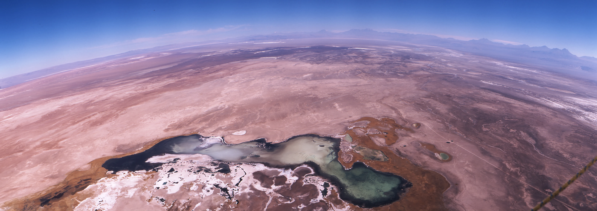
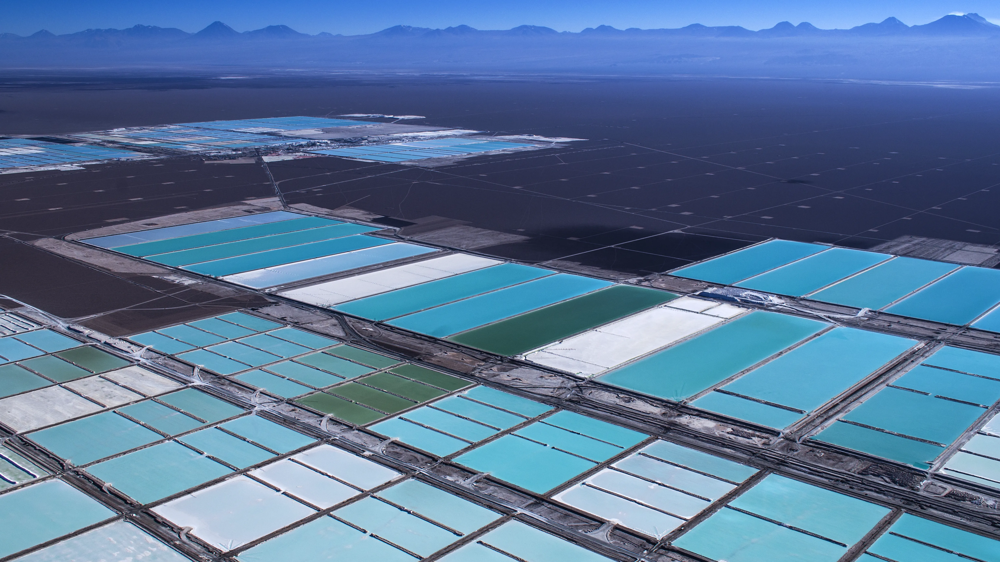

  <h1>📷 HAROLDO HORTA 📷</h1>
  <h3>50 Años de Memoria Viva / 50 Years of Living Memory</h3>
  
  
  
  

    <i>"Desde la trinchera sandinista y el asedio en Lima, hasta el silencio de la Antártida y el vuelo libre en Atacama. Un legado que documenta la dignidad humana desde el cielo y la tierra."</i>
  

  

    
  

  

    <a href="#-español"><b>🇪🇸 Español</b></a> | 
    <a href="#-english"><b>🇺🇸 English</b></a> | 
    <a href="#-português"><b>🇧🇷 Português</b></a>
  

  <h1><a href="https://haroldohorta.github.io/atlas/">🌍 ACCEDER AL ATLAS INTERACTIVO 🌍</a></h1>

---

## 🇪🇸 ESPAÑOL: El Manifiesto de una Vida

  

Este repositorio constituye el **Atlas Digital** de Haroldo Horta: 28TB de memoria fotográfica que documentan cinco décadas de historia. Un acto de resistencia y rescate patrimonial gestionado por el **Proyecto Surdao**.

### 📜 Una Trayectoria en Tres Actos

* **I. El Corresponsal (1979 - 1997):** Documentó la Nicaragua Sandinista, sobrevivió a la prisión política en 1979 y se consolidó en la prensa europea (*Stern, Spiegel, FAZ*).

  
  
<i>Retrato del Coronel Uriel Vanegas (Nicaragua), New York Times, 1987.</i>

  
* **II. La Luz del Fin del Mundo (1998 - 2022):** Trabajo editorial en Chile con Editorial Kactus y registro de soberanía para la Armada de Chile en la Antártida y faros remotos.

 
  
<i>Operación Chavín de Huántar, Lima, 1997.</i>

* **III. El Vuelo Esencial y el Legado (Presente):** Proceso de digitalización y preservación del patrimonio visual acumulado.

  

  
 

---

## 🇺🇸 ENGLISH: Archive Summary

This repository hosts the digital legacy of international photojournalist **Haroldo Horta**. From the frontlines of the Sandinista Revolution to the remote Antarctic bases of the Chilean Navy, this archive documents 50 years of global history through the lens of one of Latin America's most prolific photographers.

---

## 🇧🇷 PORTUGUÊS: Resumo do Arquivo

  

Este repositório contém o legado digital de **Haroldo Horta**. Como correspondente internacional e fotógrafo editorial, Horta registrou momentos cruciais da história e geografia latino-americana para os principais veículos de comunicação do mundo.

---

## 🎓 Respaldo Académico e Investigación

La obra de Haroldo Horta es objeto de estudio por su valor en la reconstrucción de la memoria histórica latinoamericana.

* **Investigación:** *"Fotógrafos suecos y la Revolución Sandinista"* por el historiador Fernando Camacho Padilla (UAM).
* **Documento:** [👉 Leer investigación académica completa aquí (PDF)](https://rephip.unr.edu.ar/bitstream/handle/2133/21434/Camacho%20Padilla_Aletheia.pdf)

  
  
<i>Exposición histórica en el Fotograficentrum de Estocolmo (1984).</i>

---

## 🛡️ Blindaje del Legado y Propiedad

Como parte del **Proyecto Surdao**, cada pieza de este archivo ha pasado por un proceso de validación técnica y legal para asegurar su permanencia, autoría y correcta gestión de derechos de propiedad intelectual.

  
    
  
  
<i>Haroldo Horta junto al equipo central de la agencia Zeitenspiegel en Alemania.</i>

**© 2026 Haroldo Horta / Proyecto Surdao. Todos los derechos reservados.**
