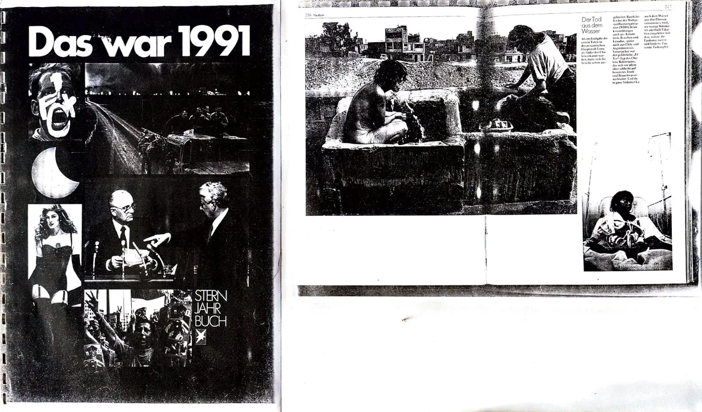
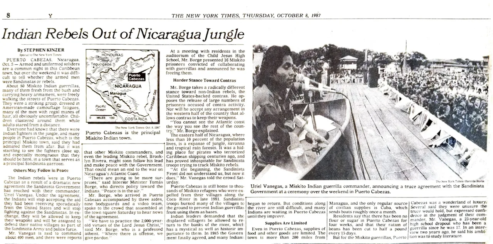
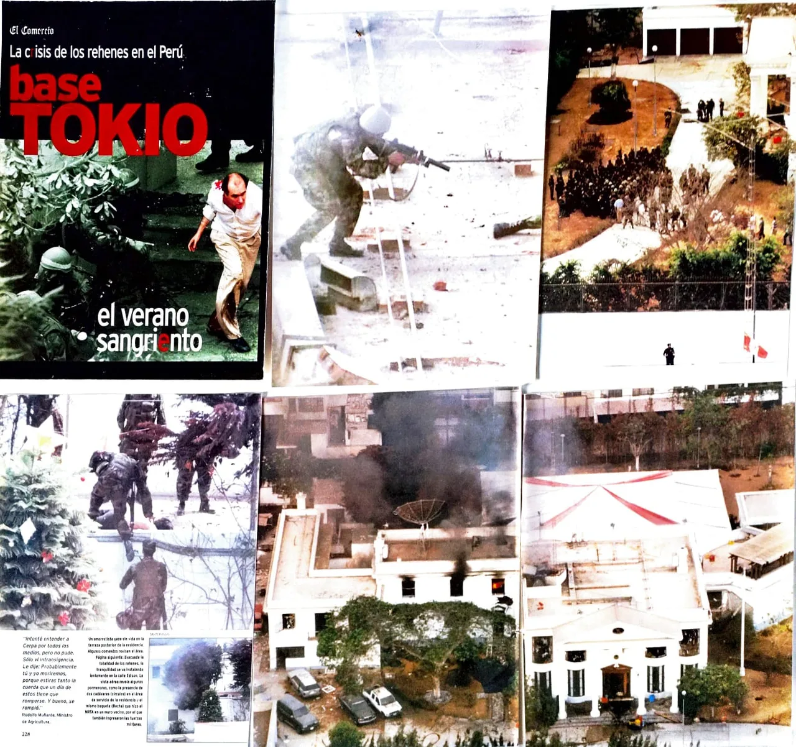
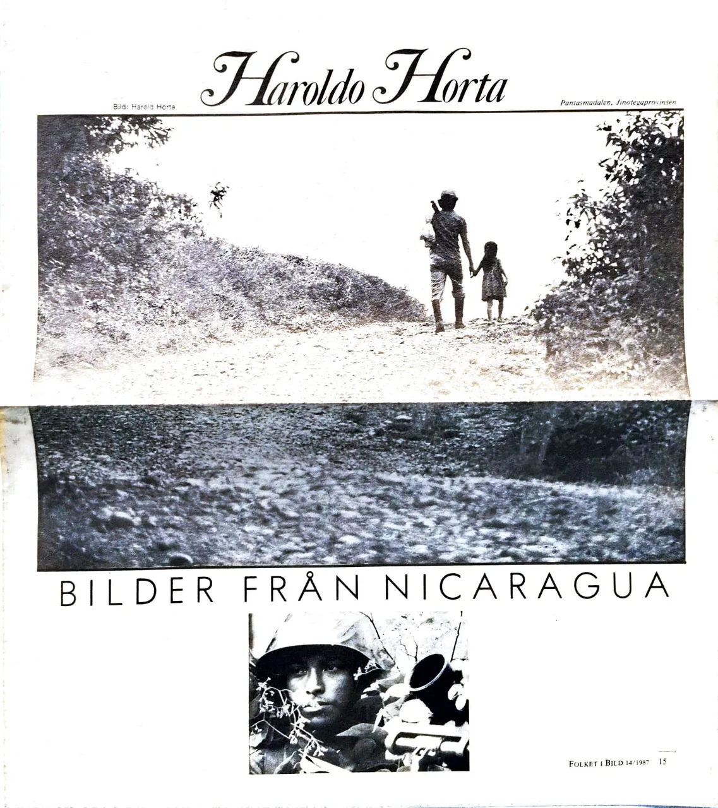
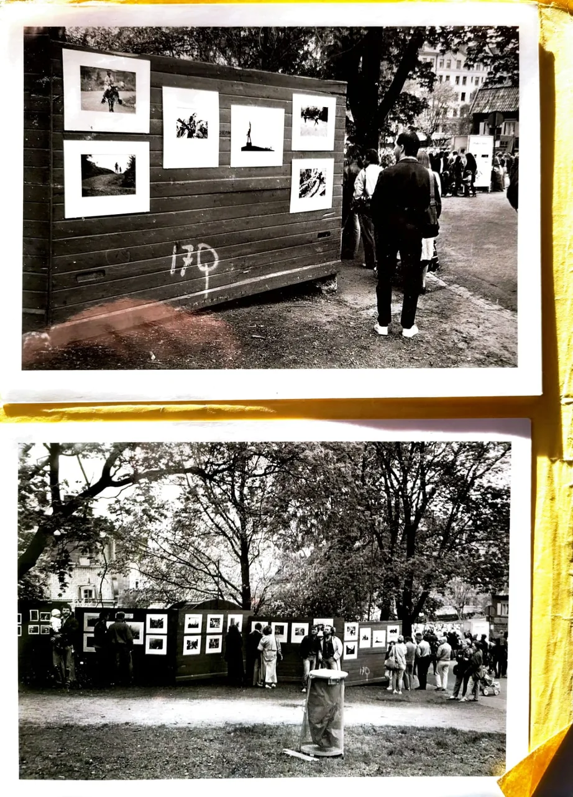
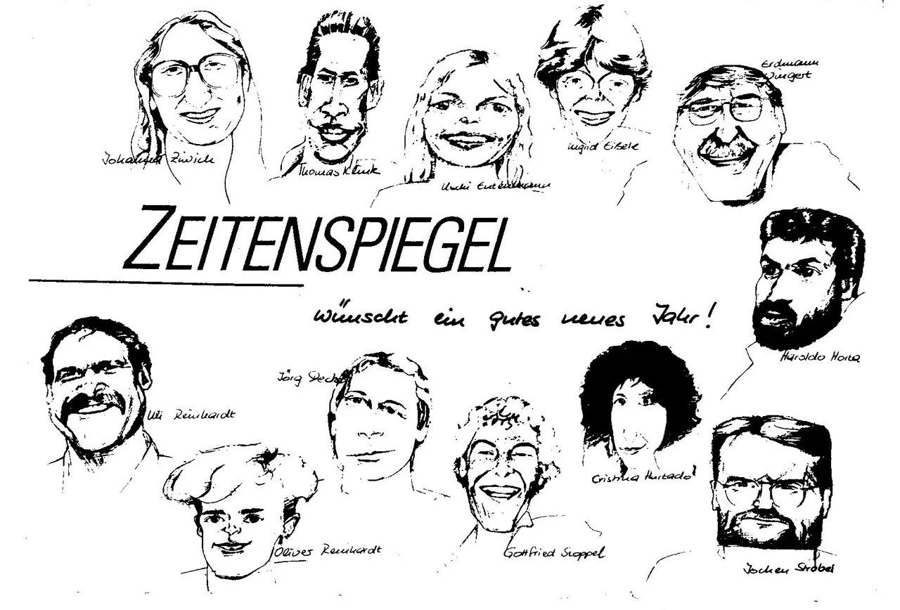

  <h1>📷 HAROLDO HORTA 📷</h1>
  <h3>50 Años de Memoria Viva / 50 Years of Living Memory</h3>
  
  
  
  

    <i>"Desde la trinchera sandinista y el asedio en Lima, hasta el silencio de la Antártida y el vuelo libre en Atacama. Un legado que documenta la dignidad humana desde el cielo y la tierra."</i>
  

  

    
     
    <small><i>Apoya el rescate y digitalización de este archivo histórico.</i></small>
  

  

    <a href="#-español-el-manifiesto-de-una-vida">🇪🇸 Español</a> | 
    <a href="#-english-the-archive-summary">🇺🇸 English</a> | 
    <a href="#-português-resumo-do-arquivo">🇧🇷 Português</a>
  

  <h1><a href="https://haroldohorta.github.io/atlas/">🌍 ACCEDER AL ATLAS INTERACTIVO 🌍</a></h1>

---

## 🇪🇸 Español: El Manifiesto de una Vida

Este repositorio constituye el **Atlas Digital** de Haroldo Horta: 28TB de memoria fotográfica que documentan cinco décadas de historia. Un acto de resistencia y rescate patrimonial gestionado por el **Proyecto Surdao**.

### 📜 Una Trayectoria en Tres Actos

#### I. El Corresponsal (1979 - 1997)
Documentó la **Nicaragua Sandinista**, sobrevivió a la prisión política en 1979 y se consolidó en la plana mayor de la prensa europea (*Stern, Spiegel, FAZ*).

<i>Retrato del Coronel Uriel Vanegas (Nicaragua), publicado por el New York Times en 1987.</i>

#### II. La Luz del Fin del Mundo (1998 - 2022)
Consolidación editorial en Chile:
* **Editorial Kactus:** Creación de obras iconográficas sobre la geografía y cultura nacional.
* **La Armada de Chile:** Registro de la soberanía nacional en bases antárticas y faros remotos.

<i><b>Operación Chavín de Huántar:</b> Registro aéreo del asedio a la Embajada de Japón en Lima (1997).</i>

#### III. El Vuelo Esencial y el Legado (Presente)
Hoy, Haroldo asume el compromiso ético de digitalizar su vida. El aterrizaje final de una memoria que ya no cabe en una maleta.

---

## 🏛️ Validación y Prensa Internacional

| Medio / Agencia | Hito Histórico / Referencia |
| :--- | :--- |
| **Stern (Alemania)** | [Imágenes del Año (Anuario 1991)](assets_web/horta-stern-jahrbuch-portada-1991.webp) |
| **La Nación (Arg)** | [Haroldo Horta: El fotógrafo que vuela](https://www.lanacion.com.ar/turismo/haroldo-horta-el-fotografo-que-vuela-nid1789782/) |
| **La Tercera (Chile)** | [Una vida de alto vuelo](https://www.latercera.com/diario-impreso/una-vida-de-alto-vuelo) |

<i>Portada de la revista sueca "Folket i Bild" (1987).</i>

---

## 🇺🇸 English: The Archive Summary

This repository hosts the digital legacy of international photojournalist **Haroldo Horta**. From the frontlines of the Sandinista Revolution to the remote Antarctic bases of the Chilean Navy, this archive documents 50 years of global history.

---

## 🇧🇷 Português: Resumo do Arquivo

Este repositório contém o legado digital de **Haroldo Horta**. Horta registrou momentos cruciais da história e geografia latino-americana, trabalhando para a *Editorial Kactus* e a *Marinha do Chile*.

---

## 🎓 Respaldo Académico e Investigación
La obra de Haroldo Horta ha sido objeto de estudio por su valor en la reconstrucción de la memoria histórica.
* **Investigación:** *"Fotógrafos suecos y la Revolución Sandinista"* por el historiador **Fernando Camacho Padilla** (UAM).
* **Artículo:** [Leer investigación académica completa aquí](https://rephip.unr.edu.ar/bitstream/handle/2133/21434/Camacho%20Padilla_Aletheia.pdf)

<i>Registro de la exposición histórica en el Fotograficentrum de Estocolmo (1984).</i>

---

## 🛡️ Blindaje y Cierre del Legado

Como parte del **Proyecto Surdao**, cada pieza de este archivo ha pasado por un proceso de validación técnica y legal para asegurar su permanencia y autoría.

<i>Haroldo Horta junto al equipo central de la agencia Zeitenspiegel en Alemania.</i>

**© 2026 Haroldo Horta / Proyecto Surdao. Todos los derechos reservados.**

  
<b>Contacto para instituciones y prensa:</b> <a href="mailto:haroldohorta@gmail.com">haroldohorta@gmail.com</a>

