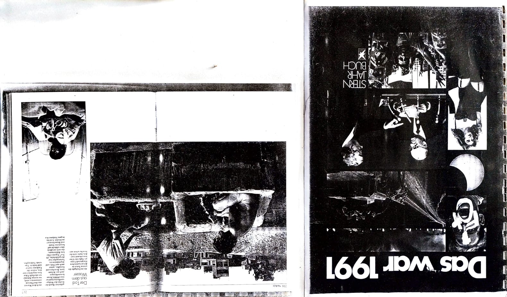
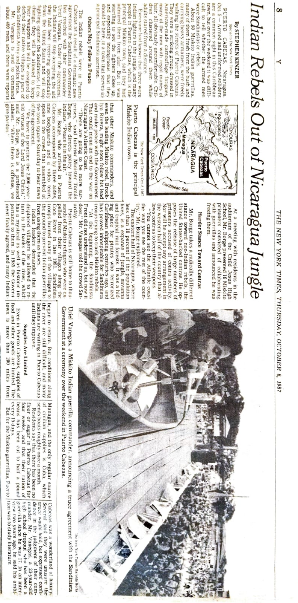
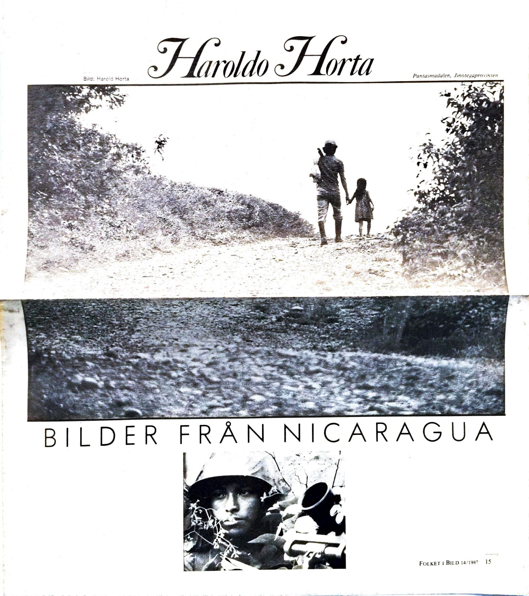
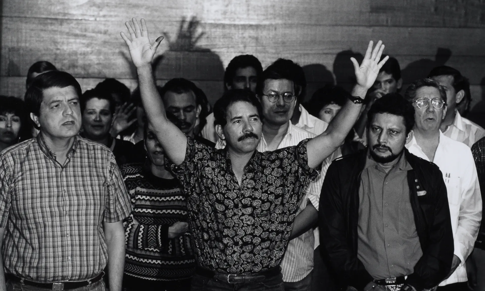
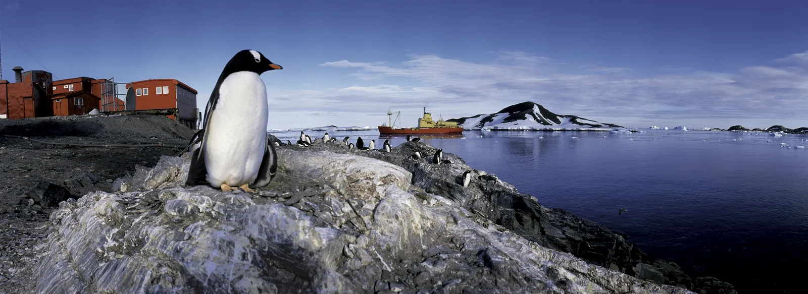

  <h1>📷 HAROLDO HORTA 📷</h1>
  <h3>50 Años de Memoria Viva / 50 Years of Living Memory</h3>
  
  
  
  

    <i>"De la trinchera al cielo: un registro ininterrumpido de la dignidad humana y la majestuosidad del territorio."</i>
  

  

    
  

  

    <a href="#-español"><b>🇪🇸 Español</b></a> | 
    <a href="#-english"><b>🇺🇸 English</b></a> | 
    <a href="#-português"><b>🇧🇷 Português</b></a>
  

  <h1><a href="https://haroldohorta.github.io/atlas/">🌍 ACCEDER AL ATLAS INTERACTIVO 🌍</a></h1>

---

## 🇪🇸 ESPAÑOL: El Manifiesto de una Vida

Este repositorio constituye el **Atlas Digital** de Haroldo Horta: 28TB de memoria fotográfica que documentan cinco décadas de historia global. Gestionado por el **Proyecto Surdao**, este archivo es un acto de resistencia cultural y rescate patrimonial.

### 📜 Una Trayectoria en Tres Actos

#### I. El Corresponsal (1979 - 1997)
Documentó la Nicaragua Sandinista (sobreviviendo a la prisión política en 1979) y los conflictos sociales en Perú, integrando la plana mayor de la prensa europea.

#### II. La Luz del Fin del Mundo (1997 - 2022)
Este período marca un hito fundamental: el cierre de la etapa de corresponsalía y la apertura de una faceta innovadora. Haroldo comienza a utilizar su **ultraligero** no solo para el vuelo deportivo, sino como una plataforma tecnológica para realizar fotografía aérea al más alto nivel. 

Esta transición permitió la definición iconográfica de la geografía de Chile a través de **Editorial Kactus** y el registro exhaustivo de la soberanía nacional junto a la **Armada de Chile** en la Antártida y faros remotos.

#### II. La Luz del Fin del Mundo (1997 - 2022)
Este período marca un hito fundamental: el cierre de la etapa de corresponsalía y la apertura de una faceta innovadora. Haroldo comienza a utilizar su **ultraligero** no solo para el vuelo deportivo, sino como una plataforma tecnológica para realizar fotografía aérea al más alto nivel. 

Esta transición permitió la definición iconográfica de la geografía de Chile a través de **Editorial Kactus** y el registro exhaustivo de la soberanía nacional junto a la **Armada de Chile**.

<table>
  <tr valign="middle">
    <td width="48%" align="center" style="border: none;">
      
      
<i>Operación Chavín de Huántar (1997).</i>

    </td>
    <td width="48%" align="center" style="border: none;">
      
      
<i>Editorial Kactus: Identidad visual de Chile.</i>

    </td>
  </tr>
</table>

#### III. El Vuelo Esencial (Presente)
El legado se digitaliza mientras la mirada evoluciona hacia el "vuelo libre" sobre los paisajes del altiplano, capturando la esencia del territorio desde una perspectiva cenital única.

---

## 🏛️ Validación y Prensa Internacional

| Medio / Agencia | Hito Histórico / Referencia |
| :--- | :--- |
| **Stern (Alemania)** | "Imágenes del Año" en el Anuario 1991. |
| **The New York Times** | Reportaje sobre la Paz Indígena Miskita, Nicaragua (1987). |
| **La Nación (Arg)** | [Haroldo Horta: El fotógrafo que vuela](https://www.lanacion.com.ar/turismo/haroldo-horta-el-fotografo-que-vuela-nid1789782/) |
| **La Tercera (Chile)** | [Una vida de alto vuelo](https://www.latercera.com/diario-impreso/una-vida-de-alto-vuelo) |

---

## 🎞️ Dossiers Especiales: Memoria y Conflicto

Esta sección destaca coberturas específicas que marcaron la agenda informativa internacional y que hoy forman parte del patrimonio visual del **Proyecto Surdao**.

### 📰 I. El Ojo de la Prensa Europea
Registro de las publicaciones que validan la trayectoria de Haroldo en los medios más influyentes del siglo XX.

<table>
<tr valign="middle">
<td width="33%" align="center" style="border: none;">

</td>
<td width="33%" align="center" style="border: none;">

</td>
<td width="33%" align="center" style="border: none;">

</td>
</tr>
</table>

<i>Documentación histórica: Coberturas en Der Spiegel (Alemania), New York Times (EE.UU.) y Bilder (Europa).</i>

| Publicación | Contenido del Dossier |
| :--- | :--- |
| **Der Spiegel** | Crónica visual "Das War 1991" y reportajes sobre la Pampa. |
| **Stern / Jahrbuch** | Selección de las mejores imágenes del año (1991). |
| **El Comercio (Perú)** | Cobertura histórica del asedio a la Embajada de Japón (1997). |
| **Revistas Suecas** | Monografías sobre la Revolución Sandinista y crisis sociales. |

### 🇨🇴 II. Medellín: El Pulso de la Violencia
Un registro crudo y necesario sobre la crisis institucional en Colombia, capturando la despedida de los agentes caídos y el impacto en la sociedad civil.

  
  
<i>Escenas de la crisis en Medellín: El costo humano del conflicto.</i>

---

### 🇳🇮 III. Nicaragua: El Sueño y la Caída

Desde la efervescencia de la Revolución Sandinista hasta el impacto de la derrota electoral de 1989. Un archivo único sobre el poder y la resistencia en Centroamérica.

### 🇳🇮 III. Nicaragua: El Sueño y la Caída

Desde la efervescencia de la Revolución Sandinista hasta el impacto de la derrota electoral de 1989. Un archivo único sobre el poder y la resistencia en Centroamérica.

<table>
  <tr valign="middle">
    <td width="33%" align="center" style="border: none;">
      
    </td>
    <td width="33%" align="center" style="border: none;">
      
    </td>
    <td width="33%" align="center" style="border: none;">
      
    </td>
  </tr>
</table>

<i>Tríptico de conflicto: El fragor del combate, el despliegue logístico y el desenlace político.</i>

## 🎓 Respaldo Académico e Investigación

* **Investigación:** *"Fotógrafos suecos y la Revolución Sandinista"* por Fernando Camacho Padilla (UAM).
* **Documento:** [👉 Leer investigación académica completa aquí (PDF)](https://rephip.unr.edu.ar/bitstream/handle/2133/21434/Camacho%20Padilla_Aletheia.pdf)

  
  
<i>Exposición histórica en el Fotograficentrum de Estocolmo (1984).</i>

---

## 🇺🇸 ENGLISH: The Architecture of Memory

  

This digital repository hosts the professional legacy of **Haroldo Horta**, whose career covers 50 years of global history. From the Sandinista Revolution to the Antarctic bases, this archive preserves the visual DNA of a continent.

---

## 🇧🇷 PORTUGUÊS: Resumo do Arquivo

  

Este repositório contém o legado digital de **Haroldo Horta**. Como correspondente internacional e fotógrafo editorial, Horta registrou momentos cruciais da história latino-americana, unindo o rigor jornalístico à majestade do território.

---

## 🛡️ Blindaje del Legado y Propiedad

Como parte del **Proyecto Surdao**, es parte de un proyecto de recuperacion de trayectorias humanas, cada pieza de este archivo ha sido validada técnica y legalmente para asegurar su autoría y permanencia.

  

 

  
<b>© 2026 Haroldo Horta / Proyecto Surdao. Todos los derechos reservados.</b>

 
  

   
  
<i>Haroldo Horta junto al equipo central de la agencia Zeitenspiegel en Alemania.</i>

