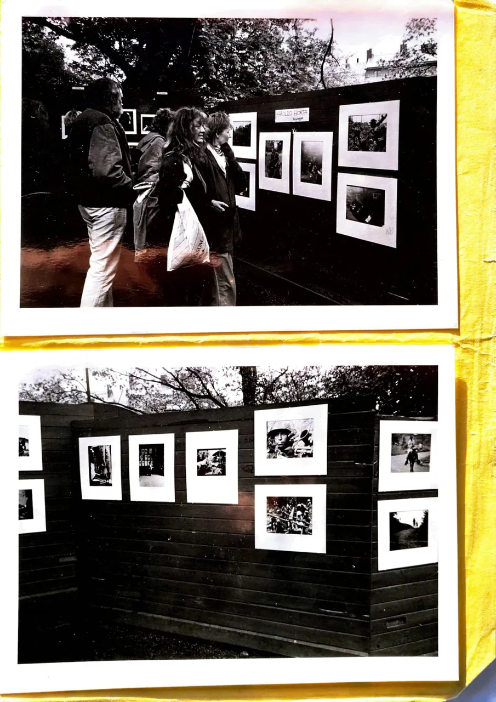

  <h1>📷 HAROLDO HORTA 📷</h1>
  <h3>50 Años de Memoria Viva / 50 Years of Living Memory</h3>
  
  
  
  

    <i>"Desde la trinchera sandinista y el asedio en Lima, hasta el silencio de la Antártida y el vuelo libre en Atacama. Un legado que documenta la dignidad humana desde el cielo y la tierra."</i>
  

  

    
     
    <small><i>Apoya el rescate y digitalización de este archivo histórico.</i></small>
  

  <h1><a href="https://haroldohorta.github.io/atlas/">🌍 ACCEDER AL ATLAS INTERACTIVO 🌍</a></h1>

---

## 🇪🇸 Español: El Manifiesto de una Vida

Este repositorio constituye el **Atlas Digital** de Haroldo Horta: 28TB de memoria fotográfica que documentan cinco décadas de historia. Un acto de rescate patrimonial gestionado por el **Proyecto Surdao**.

### 📜 Una Trayectoria en Tres Actos

#### I. El Corresponsal (1979 - 1997) | *El Barro y la Trinchera*
Documentó la **Nicaragua Sandinista**, sobrevivió a la prisión política en 1979 y trabajó para la plana mayor de la prensa europea (*Stern, Spiegel, FAZ*).

<i>Retrato del Coronel Uriel Vanegas (Nicaragua), publicado por el New York Times en 1987.</i>

#### II. La Luz del Fin del Mundo (1998 - 2022) | *Patrimonio y Soberanía*
Consolidación como referente editorial en Chile, uniendo la precisión técnica con la majestuosidad geográfica:
* **Editorial Kactus:** Creación de obras iconográficas sobre la geografía y cultura chilena.
* **La Armada de Chile:** Registro de la soberanía nacional, desde bases antárticas hasta faros remotos.

<i><b>Operación Chavín de Huántar:</b> Registro aéreo del asedio a la Embajada de Japón en Lima (1997).</i>

#### III. El Vuelo Esencial y el Legado (Presente)
Hoy, Haroldo asume el compromiso ético de digitalizar su vida. El aterrizaje final de una memoria que ya no cabe en una maleta, sino que pertenece al patrimonio mundial.

---

## 🏛️ Validación y Prensa Internacional

| Medio / Agencia | Hito Histórico / Referencia |
| :--- | :--- |
| **Stern (Alemania)** | [Imágenes del Año (Anuario 1991)](assets_web/horta-stern-jahrbuch-portada-1991.webp) |
| **La Nación (Arg)** | [Haroldo Horta: El fotógrafo que vuela](https://www.lanacion.com.ar/turismo/haroldo-horta-el-fotografo-que-vuela-nid1789782/) |
| **La Tercera (Chile)** | [Una vida de alto vuelo](https://www.latercera.com/diario-impreso/una-vida-de-alto-vuelo) |

<i>Portada de la revista sueca "Folket i Bild" (1987).</i>

---

## 🎓 Respaldo Académico e Investigación
* **Investigación:** *"Fotógrafos suecos y la Revolución Sandinista"* por **Fernando Camacho Padilla** (UAM).
* **Artículo:** [Leer investigación académica completa aquí](https://rephip.unr.edu.ar/bitstream/handle/2133/21434/Camacho%20Padilla_Aletheia.pdf)

<i>Registros de la exposición en el Fotograficentrum de Estocolmo (1984).</i>

---

## 🛡️ Blindaje y Cierre del Legado

Como parte del **Proyecto Surdao**, cada pieza de este archivo ha pasado por un proceso de validación legal y técnica para asegurar su permanencia.

  
  
  
<i>Documentación de derechos de autor y procesos de restauración digital.</i>

<i>Haroldo Horta junto al equipo de la agencia Zeitenspiegel en Alemania.</i>

**© 2026 Haroldo Horta / Proyecto Surdao. Todos los derechos reservados.**

  
<b>Contacto:</b> <a href="mailto:haroldohorta@gmail.com">haroldohorta@gmail.com</a>

