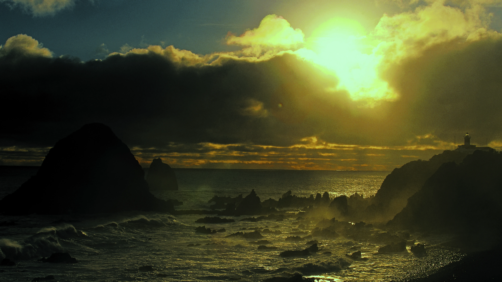
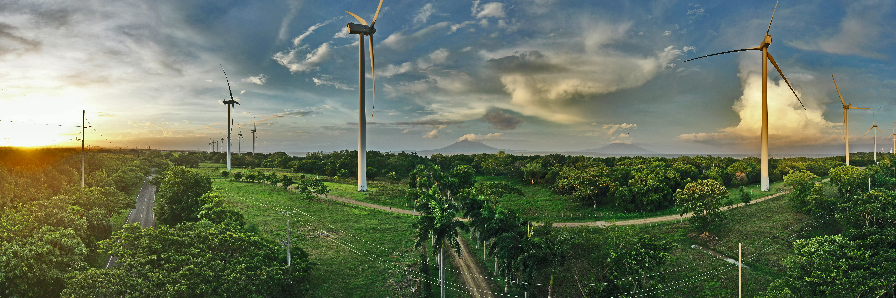
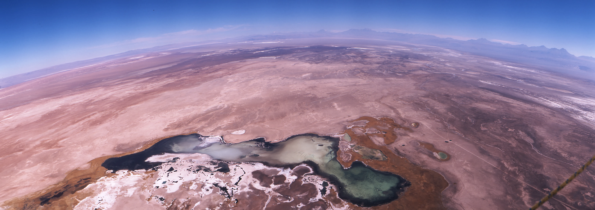
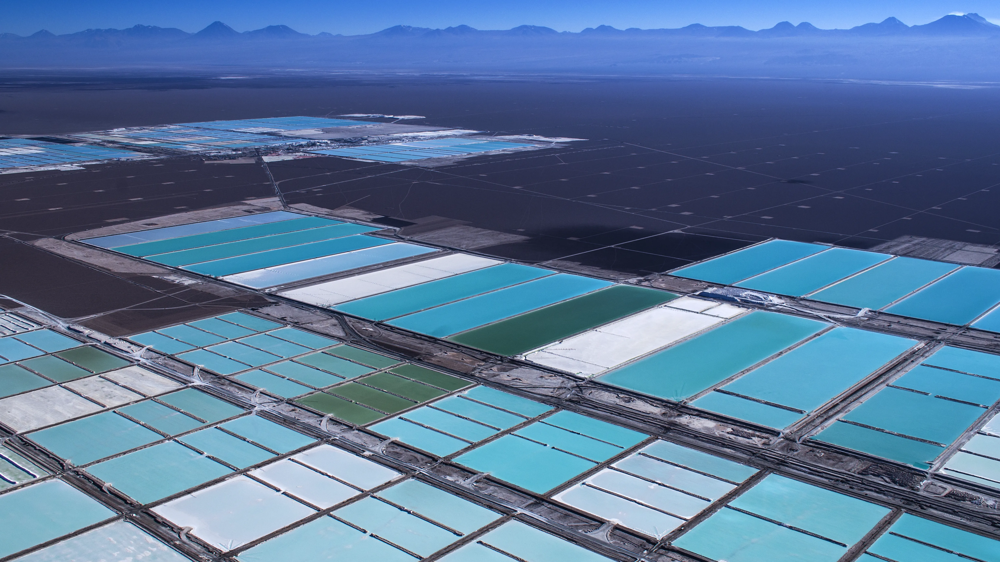
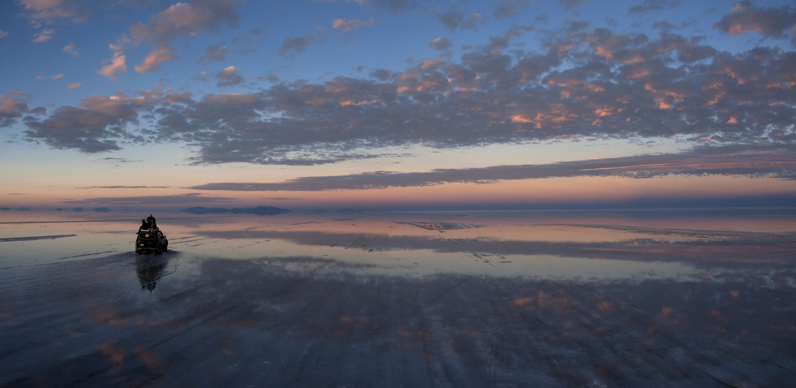
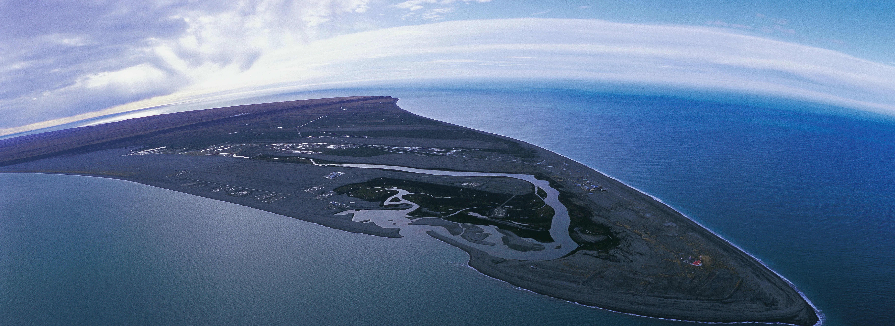

  
  
   
  <h1>📷 HAROLDO HORTA 📷</h1>
  <h3>50 Años de Memoria Viva / 50 Years of Living Memory / 50 Anos de Memória Viva</h3>
  
  

    <i>"Desde el corazon de la revolución Sandinista en Nicaragua al silencio infinito de Atacama. Un legado vivo que nos recuerda el no olvidar la dignidad humana, tanto desde el cielo como desde la tierra."</i>
  

  

    <a href="#-español">🇪🇸 Español</a> | 
    <a href="#-english">🇺🇸 English</a> | 
    <a href="#-português">🇧🇷 Português</a> |
    <a href="#-apoya-este-proyecto--support-this-project--apoie-este-projeto">💝 Apoyar / Support</a>
  

 

  <h1><a href="https://haroldohorta.github.io/atlas/">🌍 ACCEDER AL ATLAS / ACCESS THE ATLAS 🌍</a></h1>

---

## 🇪🇸 Español: El Manifiesto de una Vida

Este repositorio constituye el **Atlas Digital** de Haroldo Horta: 28TB de memoria fotográfica que documentan cinco décadas de historia latinoamericana. No es solo un archivo técnico; es un acto de resistencia y una reconexión con el valor de lo humano a través de la lente, desde el cielo y la tierra.

### Una Trayectoria en Tres Actos

#### I. El Corresponsal (1979 - 1998) | *El Barro y la Trinchera*
Documentación de la crudeza y esperanza del continente. Haroldo capturó el grano de la historia en la **Nicaragua Sandinista** (1979-1985), los conflictos armados de **Perú** y la resistencia obrera en **Lota**, Chile. Fotografía de guerra, fotoperiodismo social y registro de movimientos populares definen esta etapa donde la cámara fue testigo de transformaciones históricas.

#### II. La Luz del Fin del Mundo (1999 - 2022) | *Patrimonio y Perspectiva*
Una etapa de consolidación editorial donde la técnica se puso al servicio del patrimonio nacional y la soberanía territorial. Proyectos emblemáticos incluyen:
- **Faros de Chile** (Dirección del Territorio Marítimo)
- **Antártida Chilena** (expediciones científicas y patrimoniales)
- **Rapa Nui** (registro cultural y arqueológico)
- **Patagonia y Zona Austral** (documentación geográfica y ambiental)

#### III. Memoria Viva y Libertad (2023 - Presente)
Tras jubilar, Haroldo decidió transformar su vida en una "casa estudio rodante". Hoy habita el territorio en un Motor Home junto a sus perros, explorando Sudamérica en libertad absoluta. En esta etapa, actúa como un **registrador etnográfico libre**, capturando historias desde el aire en Paramotor y desde la ruta, compartiendo la mística de quien vive haciendo lo que le apasiona.

### 🏛️ Validación Internacional y Respaldo de Prensa
La mirada de Haroldo ha sido el lente de medios globales, validando una vida dedicada al registro de calidad:

| Bloque Editorial | Medios Destacados | Validación Documental |
| :--- | :--- | :--- |
| **Prensa Europea** | *Stern*, *Folket i Bild*, *Zeitenspiegel* | [Evidencia: Reportajes Suecia/Alemania](https://drive.google.com/drive/folders/1RQokGcrZrStpAMnyHUbsdlw8y3tECjOq) |
| **Prensa Latinoamérica** | *Paula*, *Página/12*, *La Tercera* | [Entrevista: Una vida de alto vuelo](https://www.latercera.com/diario-impreso/una-vida-de-alto-vuelo/) |
| **Patrimonio** | *Kactus*, *UNESCO*, *Armada de Chile* | [Catálogo: Faros de Chile (Amazon)](https://www.amazon.com/-/es/Lighthouses-Direccion-Territorio-Maritime-Mercante/dp/9567136246) |

### 📂 Estructura del Archivo

- **`fotos/`**: Archivo maestro en formato TIFF sin compresión con metadatos EXIF completos
- **`data/`**: Bases de datos georreferenciadas, metadatos JSON y CSV de catalogación
- **`scripts/`**: Herramientas de procesamiento, geolocalización y exportación
- **`public/`**: Versiones web optimizadas para visualización online

### 🗺️ Metodología de Georreferenciación

Cada fotografía del atlas está vinculada a coordenadas geográficas precisas cuando el contexto histórico lo permite. El sistema de metadatos incluye:
- Coordenadas GPS (latitud/longitud)
- Fecha y contexto histórico
- Categorización temática
- Derechos y atribuciones

[↑ Volver al inicio](#-español)

---

## 🇺🇸 English: The Nomadic Eye

This repository hosts the **Digital Atlas** of Haroldo Horta: 28TB of photographic memory documenting five decades of Latin American history. It's not merely a technical archive—it's an act of resistance and a reconnection with human value through the lens, from sky and earth.

### A Journey in Three Acts

#### I. The Correspondent (1979 - 1998) | *Mud and Trenches*
Documentation of the continent's harshness and hope. Haroldo captured the grain of history during the **Sandinista Nicaragua** revolution (1979-1985), armed conflicts in **Peru**, and labor resistance in **Lota**, Chile. War photography, social photojournalism, and documentation of popular movements define this era where the camera witnessed historic transformations.

#### II. Light from the End of the World (1999 - 2022) | *Heritage and Perspective*
An era of editorial consolidation where technique served national heritage and territorial sovereignty. Landmark projects include:
- **Chilean Lighthouses** (Maritime Territory Directorate)
- **Chilean Antarctica** (scientific and heritage expeditions)
- **Rapa Nui** (cultural and archaeological documentation)
- **Patagonia and Austral Zone** (geographic and environmental documentation)

#### III. Living Memory and Freedom (2023 - Present)
After retirement, Haroldo transformed his life into a "rolling studio home." Today he inhabits the territory in a Motor Home alongside his dogs, exploring South America in absolute freedom. During this stage, he acts as a **free ethnographic recorder**, capturing stories from the air via Paramotor and from the road, sharing the mystique of someone living their passion.

### 🏛️ International Recognition and Press Validation
Haroldo's vision has served as the lens for global media outlets, validating a lifetime dedicated to quality documentation:

| Editorial Sphere | Featured Media | Documentary Evidence |
| :--- | :--- | :--- |
| **European Press** | *Stern*, *Folket i Bild*, *Zeitenspiegel* | [Evidence: Sweden/Germany Reports](https://drive.google.com/drive/folders/1RQokGcrZrStpAMnyHUbsdlw8y3tECjOq) |
| **Latin American Press** | *Paula*, *Página/12*, *La Tercera* | [Interview: A High-Flying Life](https://www.latercera.com/diario-impreso/una-vida-de-alto-vuelo/) |
| **Heritage** | *Kactus*, *UNESCO*, *Chilean Navy* | [Catalog: Lighthouses of Chile (Amazon)](https://www.amazon.com/-/es/Lighthouses-Direccion-Territorio-Maritime-Mercante/dp/9567136246) |

### 📂 Archive Structure

- **`fotos/`**: Master archive in uncompressed TIFF format with complete EXIF metadata
- **`data/`**: Georeferenced databases, JSON metadata, and cataloging CSVs
- **`scripts/`**: Processing, geolocation, and export tools
- **`public/`**: Web-optimized versions for online viewing

### 🗺️ Georeferencing Methodology

Each photograph in the atlas is linked to precise geographic coordinates when historical context permits. The metadata system includes:
- GPS coordinates (latitude/longitude)
- Date and historical context
- Thematic categorization
- Rights and attributions

[↑ Back to top](#-english)

---

## 🇧🇷 Português: Memória Viva

Este repositório abriga o **Atlas Digital** de Haroldo Horta: 28TB de memória fotográfica que documentam cinco décadas de história latino-americana. Não é apenas um arquivo técnico; é um ato de resistência e uma reconexão com o valor humano através das lentes, do céu e da terra.

### Uma Jornada em Três Atos

#### I. O Correspondente (1979 - 1998) | *Lama e Trincheira*
Documentação da dureza e esperança do continente. Haroldo capturou o grão da história durante a **Nicarágua Sandinista** (1979-1985), os conflitos armados no **Peru** e a resistência operária em **Lota**, Chile. Fotografia de guerra, fotojornalismo social e registro de movimentos populares definem esta época onde a câmera testemunhou transformações históricas.

#### II. A Luz do Fim do Mundo (1999 - 2022) | *Patrimônio e Perspectiva*
Uma era de consolidação editorial onde a técnica serviu ao patrimônio nacional e à soberania territorial. Projetos emblemáticos incluem:
- **Faróis do Chile** (Diretoria do Território Marítimo)
- **Antártica Chilena** (expedições científicas e patrimoniais)
- **Rapa Nui** (documentação cultural e arqueológica)
- **Patagônia e Zona Austral** (documentação geográfica e ambiental)

#### III. Memória Viva e Liberdade (2023 - Presente)
Após se aposentar, Haroldo transformou sua vida em uma "casa-estúdio rodante". Hoje habita o território em um Motor Home ao lado de seus cães, explorando a América do Sul em liberdade absoluta. Nesta etapa, atua como um **registrador etnográfico livre**, capturando histórias do ar via Paramotor e da estrada, compartilhando a mística de quem vive sua paixão.

### 🏛️ Reconhecimento Internacional e Validação pela Imprensa
A visão de Haroldo serviu como lente para veículos de comunicação globais, validando uma vida dedicada à documentação de qualidade:

| Esfera Editorial | Mídia Destacada | Evidência Documental |
| :--- | :--- | :--- |
| **Imprensa Europeia** | *Stern*, *Folket i Bild*, *Zeitenspiegel* | [Evidência: Reportagens Suécia/Alemanha](https://drive.google.com/drive/folders/1RQokGcrZrStpAMnyHUbsdlw8y3tECjOq) |
| **Imprensa Latino-Americana** | *Paula*, *Página/12*, *La Tercera* | [Entrevista: Uma Vida de Alto Voo](https://www.latercera.com/diario-impreso/una-vida-de-alto-vuelo/) |
| **Patrimônio** | *Kactus*, *UNESCO*, *Marinha do Chile* | [Catálogo: Faróis do Chile (Amazon)](https://www.amazon.com/-/es/Lighthouses-Direccion-Territorio-Maritime-Mercante/dp/9567136246) |

### 📂 Estrutura do Arquivo

- **`fotos/`**: Arquivo mestre em formato TIFF sem compressão com metadados EXIF completos
- **`data/`**: Bases de dados georreferenciadas, metadados JSON e CSVs de catalogação
- **`scripts/`**: Ferramentas de processamento, geolocalização e exportação
- **`public/`**: Versões otimizadas para web para visualização online

### 🗺️ Metodologia de Georreferenciamento

Cada fotografia do atlas está vinculada a coordenadas geográficas precisas quando o contexto histórico permite. O sistema de metadados inclui:
- Coordenadas GPS (latitude/longitude)
- Data e contexto histórico
- Categorização temática
- Direitos e atribuições

[↑ Voltar ao topo](#-português)

---

## ⚖️ Licencia / License / Licença

**Creative Commons Atribución-NoComercial-SinDerivadas 4.0 Internacional**  
*Creative Commons Attribution-NonCommercial-NoDerivatives 4.0 International*  
*Creative Commons Atribuição-NãoComercial-SemDerivações 4.0 Internacional*

### 🇪🇸 Español
**Usted es libre de:**
- **Compartir:** Copiar y redistribuir el material en cualquier medio o formato

**Bajo los siguientes términos:**
- **Atribución:** Debe dar crédito apropiado a Haroldo Horta
- **No Comercial:** No puede utilizar el material con fines comerciales
- **Sin Derivadas:** Si remezcla, transforma o crea a partir del material, no puede distribuir el material modificado

### 🇺🇸 English
**You are free to:**
- **Share:** Copy and redistribute the material in any medium or format

**Under the following terms:**
- **Attribution:** You must give appropriate credit to Haroldo Horta
- **NonCommercial:** You may not use the material for commercial purposes
- **NoDerivatives:** If you remix, transform, or build upon the material, you may not distribute the modified material

### 🇧🇷 Português
**Você é livre para:**
- **Compartilhar:** Copiar e redistribuir o material em qualquer meio ou formato

**Sob os seguintes termos:**
- **Atribuição:** Você deve dar crédito apropriado a Haroldo Horta
- **NãoComercial:** Você não pode usar o material para fins comerciais
- **SemDerivações:** Se você remixar, transformar ou criar a partir do material, não pode distribuir o material modificado

## 👤 Sobre el Fotógrafo / About the Photographer / Sobre o Fotógrafo

**Haroldo Horta** (Chile, 1954) es fotógrafo documental, piloto de paramotor y archivista de memoria histórica. Su trabajo abarca desde el fotoperiodismo de guerra en Centroamérica hasta la documentación patrimonial de territorios australes. Actualmente vive de forma nómade recorriendo Sudamérica en su motor home, combinando fotografía aérea y registro etnográfico.

**Haroldo Horta** (Chile, 1954) is a documentary photographer, paramotor pilot, and historical memory archivist. His work spans from war photojournalism in Central America to heritage documentation of southern territories. He currently lives nomadically traveling through South America in his motor home, combining aerial photography and ethnographic documentation.

**Haroldo Horta** (Chile, 1954) é fotógrafo documental, piloto de paramotor e arquivista de memória histórica. Seu trabalho abrange desde o fotojornalismo de guerra na América Central até a documentação patrimonial de territórios austrais. Atualmente vive de forma nômade percorrendo a América do Sul em seu motor home, combinando fotografia aérea e registro etnográfico.

---
---

## 💝 Apoya este Proyecto / Support this Project / Apoie este Projeto

### 🇪🇸 Español
Este archivo vive gracias al esfuerzo independiente de preservar la memoria histórica.  
Si este trabajo te ha inspirado o resultado útil, considera apoyar su continuidad.

### 🇺🇸 English
This archive lives thanks to the independent effort of preserving historical memory.  
If this work has inspired you or been useful, consider supporting its continuity.

### 🇧🇷 Português
Este arquivo vive graças ao esforço independente de preservar a memória histórica.  
Se este trabalho te inspirou ou foi útil, considere apoiar sua continuidade.

---

### Formas de Apoyo / Ways to Support / Formas de Apoio

**💙 PayPal:**  

**📧 Otras formas de apoyo / Other ways to support:**  
[haroldohorta@gmail.com](mailto:haroldohorta@gmail.com)

 

*Cada aporte ayuda a mantener vivo este archivo de 28TB y continuar documentando Sudamérica desde el aire y la tierra.*  
*Every contribution helps keep this 28TB archive alive and continue documenting South America from air and land.*  
*Cada contribuição ajuda a manter vivo este arquivo de 28TB e continuar documentando a América do Sul do ar e da terra.*

---

## 📬 Contacto / Contact / Contato

- **Email:** [haroldohorta@gmail.com](mailto:haroldohorta@gmail.com)
- **Web:** [haroldohorta.github.io/atlas](https://haroldohorta.github.io/atlas/)
- **GitHub:** [@haroldohorta](https://github.com/haroldohorta)

---

 

  <h3>Desarrollado con sentido y amor en medio de una tormenta en Junín, Argentina, 2026.</h3>
  
<i>Developed with purpose and love during a storm in Junín, Argentina, 2026.</i>

  
<i>Desenvolvido com propósito e amor durante uma tempestade em Junín, Argentina, 2026.</i>

  
  

## 🛡️ Rescate Patrimonial / Heritage Rescue / Resgate Patrimonial

### 🇪🇸 Español
Este archivo representa la **Trayectoria #00** de la iniciativa de rescate de memoria impulsada por **SUR DAO**.  
Registrar la belleza y el dolor es el último acto de libertad.

### 🇺🇸 English
This archive represents **Trajectory #00** of the memory rescue initiative driven by **SUR DAO**.  
Recording beauty and pain is the ultimate act of freedom.

### 🇧🇷 Português
Este arquivo representa a **Trajetória #00** da iniciativa de resgate de memória impulsionada pela **SUR DAO**.  
Registrar a beleza e a dor é o último ato de liberdade.

---

**SUR DAO:** Tecnología descentralizada al servicio de la Memoria Histórica  
*Decentralized technology serving Historical Memory*  
*Tecnologia descentralizada a serviço da Memória Histórica*

[**🔗 Visitar Repositorio Oficial SUR DAO (Nave Madre)**](https://github.com/TIANHH77/Sur-DAO)

---
