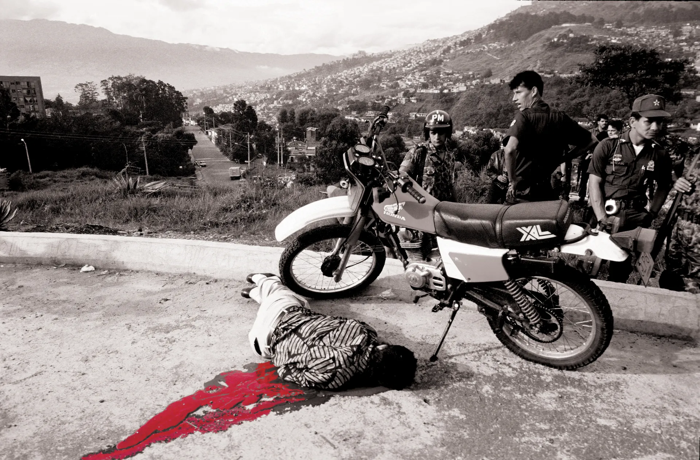

  <h1>📷 HAROLDO HORTA 📷</h1>
  <h3>50 Años de Memoria Viva / 50 Years of Living Memory</h3>
  
  
  
  

    <i>"De la trinchera al cielo: un registro ininterrumpido de la dignidad humana y la majestuosidad del territorio."</i>
  

  

    
  

  

    <a href="#-español"><b>🇪🇸 Español</b></a> | 
    <a href="#-english"><b>🇺🇸 English</b></a> | 
    <a href="#-português"><b>🇧🇷 Português</b></a>
  

  <h1><a href="https://haroldohorta.github.io/atlas/">🌍 ACCEDER AL ATLAS INTERACTIVO 🌍</a></h1>

---

## 🇪🇸 ESPAÑOL: El Manifiesto de una Vida

Este repositorio constituye el **Atlas Digital** de Haroldo Horta: 28TB de memoria fotográfica que documentan cinco décadas de historia global. Gestionado por el **Proyecto Surdao**, este archivo es un acto de resistencia cultural y rescate patrimonial.

### 📜 Una Trayectoria en Tres Actos

#### I. El Corresponsal (1979 - 1997)
Documentó la Nicaragua Sandinista (sobreviviendo a la prisión política en 1979) y los conflictos sociales en Perú, integrando la plana mayor de la prensa europea.

<table>
  <tr valign="middle">
    <td width="48%" align="center" style="border: none;">
      
      
<i>Operación Chavín de Huántar (1997).</i>

    </td>
    <td width="48%" align="center" style="border: none;">
      
      
<i>Documentación histórica: Nicaragua 1979.</i>

    </td>
  </tr>
</table>

#### II. La Luz del Fin del Mundo (1997 - 2022)
Este período marca un hito fundamental: Haroldo comienza a utilizar su **ultraligero** no solo para el vuelo deportivo, sino como una plataforma tecnológica para realizar fotografía aérea al más alto nivel. Esta transición permitió la definición iconográfica de la geografía de Chile a través de **Editorial Kactus**.

#### III. El Vuelo Esencial (Presente)
El legado se digitaliza mientras la mirada evoluciona hacia el "vuelo libre" sobre los paisajes del altiplano, capturando la esencia del territorio desde una perspectiva cenital única.

---

## 🎞️ Dossiers Especiales: Memoria y Conflicto

### 📰 I. El Ojo de la Prensa Europea
Registro de las publicaciones que validan la trayectoria de Haroldo en los medios más influyentes del siglo XX.

<table>
<tr valign="middle">
<td width="33%" align="center" style="border: none;">

</td>
<td width="33%" align="center" style="border: none;">

</td>
<td width="33%" align="center" style="border: none;">

</td>
</tr>
</table>

<i>Coberturas históricas en Der Spiegel (Alemania), New York Times (EE.UU.) y Stern (Europa).</i>

### 🇨🇴 II. Medellín: El Pulso de la Violencia
Un registro crudo y necesario sobre la crisis institucional en Colombia, capturando el impacto en la sociedad civil.

  
  
<i>Escenas de la crisis en Medellín: El costo humano del conflicto.</i>

---

## 🇺🇸 ENGLISH: The Architecture of Memory

This digital repository hosts the professional legacy of **Haroldo Horta**, whose career covers 50 years of global history. From the Sandinista Revolution to the Antarctic bases, this archive preserves the visual DNA of a continent.

  

---

## 🇧🇷 PORTUGUÊS: Resumo do Arquivo

Este repositório contém o legado digital de **Haroldo Horta**. Como correspondente internacional e fotógrafo editorial, Horta registrou momentos cruciais da história latino-americana, unindo o rigor jornalístico à majestade do território.

  

---

## 🛡️ Propiedad y Legado

Como parte del **Proyecto Surdao**, cada pieza de este archivo ha sido validada técnica y legalmente para asegurar su autoría y permanencia.

  
<b>© 2026 Haroldo Horta / Proyecto Surdao. Todos los derechos reservados.</b>

 
  

   
  
<i>Haroldo Horta junto al equipo central de la agencia Zeitenspiegel en Alemania.</i>

